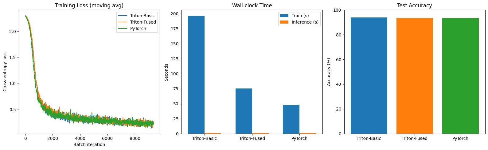
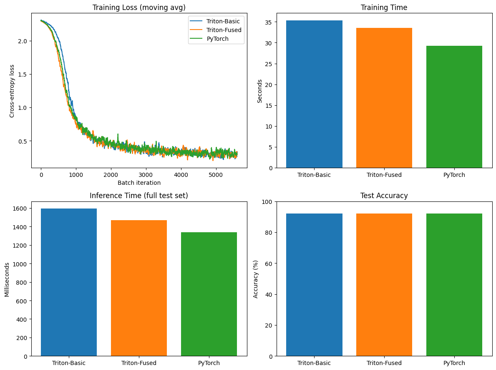

# Triton_NN

The project is called Triton_NN, that was the initial naming, and I cannot seem to come up with a better one.
    
## Short Description
This is a simple Neural Network Engine, not unlike PyTorch. It is more of a learning experience to see if I could build something similar, and so AI usage is limited to visualisations of final performance output.
    
Triton_NN is heavily inspired by the micrograd Project by the legendary Andrej Karpathy. Another motivation was to see how close I could come to actually achieving PyTorch's performance, with a simple Triton backend.
    
Triton_NN has a very simple layout. There is the `triton_configs.py` which has the autotune configs for triton kernels. These are used to cache the best pre-compiled binaries for specific dimensions of data.
    
`Tkernels.py` have the actual Kernels that are gonna run on the GPU, along with the CPU handler, that manages the kernel launches, this is all standard Triton so far. Now we have `Engine0.py` which has the actual Neural Network logic. We have a custom class called Tensor, which tracks operations performed along with their corresponding backpropagation functions, and the parent Tensors. We also have the linear and the MLP classes to help us actually build the NN.
    
Finally `train_test_2.py` is used to run the actual code. 
    
## Features
There are two versions as would be obvious from the code. One has simple linalg capabilities and the other has a fused kernel for matmul + add + relu. So just one Kernel launch that handles that. Later there could be more optimisations, like fusing the backpropagation calculations, since right now we are using some of PyTorch's capabilities in that regard.
    
## Installation/Setup
Make sure to have CC 8 and above, since my results are from A100. Running it at a lower CC like 7.5 (Turing) may not work, since triton support is mostly for the latest architecture.
    
External Dependencies - check `requirements.txt`. PyTorch and torchvision binaries were complied against CUDA TOOLKIT 13.0 in this case.
    
## Usage/Example

```python
def train_triton_basic()->MLP_X:
        
    model = MLP_X(layer_sizes)
        
    for epoch in range(epochs):
        total_loss = 0.0
            
        for batch_idx, (x_batch, y_batch) in enumerate(train_data):
            # x_batch shape: (32, 784), y_batch shape: (32,)
                
            # Convert integer labels to one-hot encoded vectors. Shape becomes (32, 10)
            y_one_hot = F.one_hot(y_batch, num_classes=10).float().to(DEVICE)
                
            # Wrap the input data in your custom Tensor class
            x_tensor = Tensor(x_batch.to(DEVICE))
                
            # --- FORWARD PASS ---
            #  MLP_X.__call__
            logits = model(x_tensor)
                
            # Connects to Tensor.softmax_entropy
            # Note: your softmax_entropy expects Y as a torch.Tensor, not your custom Tensor
            loss = logits.softmax_entropy(y_one_hot)
                
            loss.backward()
                
            # --- OPTIMIZER (Stochastic Gradient Descent) ---
            # Connects to MLP_X.parameters() -> Linear.parameters()
            for p in model.parameters():
                # Update the raw torch.Tensor data using the computed gradients
                p.data -= learning_rate * p.grad
                    
                # Zero the gradients for the next iteration
                p.grad = torch.zeros_like(p.data)
                    
            total_loss += loss.data.mean().item()
                
            if batch_idx % 100 == 0:
                print(f"Epoch {epoch}, Batch {batch_idx}, Loss: {loss.data.mean().item():.4f}")

    return model

def test_triton_basic(model):
        
    count = 0
    total = 0
    for batch_idx , (x_batch, y_batch) in enumerate(test_data):
        x_tensor = Tensor(x_batch.to(DEVICE))
        y_one_hot = F.one_hot(y_batch, num_classes=10).float().to(DEVICE)
        y_batch = y_batch.to(DEVICE)

        logits = model(x_tensor)

        logits = logits.data

        pred = torch.argmax(logits, dim=1)
        count += (pred == y_batch).sum().item()

        total += y_batch.size(0)
    accuracy = 100 * count/total
    print(f"Inference for TritonBasic ->\n correct predictions = {count}, total = {total}, percentage = {accuracy :.4f}")
```

## Performance/Results

```text
[Triton-Basic] Inference -> correct = 9372, total = 9984, accuracy = 93.8702%
[Triton-Fused] Inference -> correct = 9328, total = 9984, accuracy = 93.4295%
[PyTorch] Inference -> correct = 9314, total = 9984, accuracy = 93.2893%

==============================================================
Model          Train Time (s)    Inference (ms)    Accuracy (%)
==============================================================
Triton-Basic   196.529           1609.631          93.87        
Triton-Fused   75.271            1408.452          93.43        
PyTorch        47.610            1282.269          93.29        
==============================================================
```


The above is for 5 Epochs of training.

```text

[Triton-Basic] Inference -> correct = 9194, total = 9984, accuracy = 92.0873%
[Triton-Fused] Inference -> correct = 9204, total = 9984, accuracy = 92.1875%
[PyTorch] Inference -> correct = 9196, total = 9984, accuracy = 92.1074%

==============================================================
Model          Train Time (s)    Inference (ms)    Accuracy (%)
==============================================================
Triton-Basic   35.333            1593.612          92.09        
Triton-Fused   33.518            1469.172          92.19        
PyTorch        29.269            1340.194          92.11        
==============================================================
```



The above is for 3 Epochs of training.
